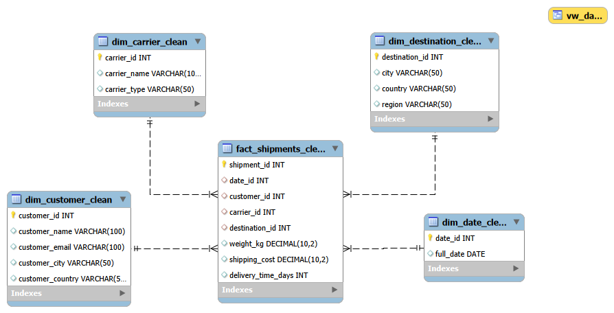

# Empresa de logística

En este proyecto se analizaron distintos factores que pueden afectar al
éxito de una empresa de logística.

## Antecedentes

Los datos se obtuvieron de una IA a la que se le solicitó cuatro tablas
de dimensiones y una tabla de hechos para realizar un trabajo en SQL. Se
le pidió una variedad de temáticas y la aparentemente más interesante (o
menos tratada) fue la que se escogió. Como el prompt que se le dio a la
IA no fue muy específico, hubo que rehacer alguna tabla.

## Datos iniciales

Los datos consisten en cuatro tablas de dimensiones y una tabla de
hechos pertenecientes la base de datos logistics, que se describen a
continuación:  

**dim_carrier**: tabla de dimensiones de las compañías de transporte, que
contiene las siguientes columnas:

**- carrier_id**: identificador de la compañía de transporte. Es la PRIMARY
KEY,. Tipo de dato INT.

**- carrier_name**: nombre de la compañía de transporte. Tipo de dato:
VARCHAR(100).

**- carrier_type**: tipo de servicio (urgente, normal, low cost). Tipo de
dato: VARCHAR(50)

**dim_customer**: tabla de dimensiones de los clientes, que contiene las
siguientes columnas:

**- customer_id**: identificador del cliente. Es la PRIMARY KEY,. Tipo de
dato: INT

**- customer_name**: nombre del cliente. Tipo de dato: VARCHAR(100)

**- customer_email**: e-mail del cliente. Tipo de dato: VARCHAR(100)

**- customer_city**: ciudad. Tipo de dato: VARCHAR(50)

**- customer_country**: país. Tipo de dato: VARCHAR(50)

**dim_data**: tabla de dimensiones que contiene todas las fechas de tres
años

**- date_id**: identificador de fecha. Es la PRIMARY KEY,. Tipo de dato: INT

**- full_date**: fecha en formato YYYY-MM-DD. Tipo de dato: DATE

**dim_destinations**: tabla de dimensiones del destino de los envíos, que
contiene las siguientes columnas:

**- destination_id**: identificador de destino. Es la PRIMARY KEY. Tipo de
dato: INT

**- city**: ciudad de destino. Tipo de dato: VARCHAR(50)

**- country**: país de destino. Tipo de dato: VARCHAR(50)

**- region**: región dentro del país. Tipo de dato: VARCHAR(50)

**fact_shipments**: tabla de hechos de los envíos, que contiene las
siguientes columnas:

**- shipment_id**: identificador de envío. Es la PRIMARY KEY. Tipo de dato:
INT

**- date_id**: identificador de fecha de envío. Es la FOREIGN KEY para la
tabla dim_date. Tipo de dato: INT

**- customer_id**: identificador de cliente. Es la FOREIGN KEY para la tabla
dim_customer. Tipo de dato: INT

**- carrier_id**: identificador de compañía de transporte. Es la FOREIGN KEY
para la tabla dim_carrier. Tipo de dato: INT

**- destination_id**: identificador de destino. Es la FOREIGN KEY para la
tabla dim_destination.Tipo de dato: INT

**- weight_kg**: peso del paquete en kg. Tipo de dato: DECIMAL(10,2)

**- shipping_cost**: precio del envío en €. Tipo de dato: DECIMAL(10,2)

**- delivery_time_days**: duración del envío en días. Tipo de dato: INT

En la figura se muestra el modelo entidad-relación

## Objetivo del análisis

Las preguntas a las que se pretende dar respuesta con este análisis de
datos, y que podrían ser de interés para el negocio son las siguientes:

**1- ¿Qué clientes son lo que más aportan?**

**2- ¿Qué empresas de transporte realizan entregas más rápidas?**

**3- ¿Qué empresas de transporte son más económicas?**

**4- ¿En qué fechas se realizan más envíos?**

**5- ¿Qué tipo de servicio en cuanto a peso del envío es el más demandado?**

**6- ¿Qué país de destino tiene más demanda? ¿Es el más rentable?**

## Procedimiento y resultados

**1\. Creación de base de datos**

Se creó la base de datos logistics, se crearon las tablas y se
insertaron los datos mediante código SQL

**2\. Limpieza de datos**

Se comprobó la presencia de duplicados, nulos, error de sintaxis en
e-mails, errores tipográficos (mayúsculas, minúsculas, acentos). Aunque
MySQL no es "case-sensitive", se homogeneizaron los datos cuando fue
necesario.

Se encontraron duplicados en filas enteras en alguna tabla de
dimensiones, por lo que hubo que eliminar algún id y corregir la tabla
de hechos al respecto.

Antes de proceder a la limpieza de las tablas, se hizo copia de cada
tabla modificando el nombre de forma que acaban en \_clean. Se hizo para
todas, por mantener la homogeneidad, incluso para aquellas que no tenían
nada que limpiar. De esta manera, se conservan las tablas originales y
se trabaja con las limpias (\_clean)

El hecho de copiar las tablas originales hizo que se perdieran las
Primary y Foreign Keys, y se tuvieron que volver a crear para que en el
modelo de tablas aparecieran las conexiones entre ellas.

**3\. Análisis de datos**

Se realizaron diferentes consultas de negocio intentando, a efectos
formativos, utilizar la mayoría de cláusulas/operadores/ funciones de
SQL.

También se realizó una vista a partir de la tabla dim_date en la que se
incluyeron columnas de año, mes y día de la semana, para facilitar
varias consultas.

El análisis nos permite contestar a las preguntas planteadas:

**1- ¿Qué clientes son lo que más aportan?**

El cliente Ana Pérez es quien más envíos realizó en los tres años de
estudio, quien más gasto efectuó en total y la que más gastó cada año.

**2- ¿Qué empresas de transporte realizan entregas más rápidas?**

La empresa que realiza entregas más rápidas es Correos Express Urgente

**3- ¿Qué empresas de transporte son más económicas?**

La empresa más económica en relación coste/peso también es Correos
Express Urgente

**4- ¿En qué fechas se realizan más envíos?**

Se observó que no se realizaron envíos ningún sábado en los tres años y
que los días con mayor número de envíos son los lunes, miércoles y
viernes. No se observan grandes diferencias respecto al mes del año. No
parece haber estacionalidad en los envíos.

**5- ¿Qué tipo de servicio en cuanto a peso del envío es el más demandado?**

Según la clasificación de peso que hemos realizado, no hay diferencias
significativas en cuanto a peso de los envíos.

**6- ¿Qué país de destino tiene más demanda? ¿Es el más rentable para la
empresa?**

El país con más demanda de envíos es España. Sin embargo, el que parece
más rentable ya que tiene el coste de envío promedio más alto es
Portugal.

## Guía de ejecución

**Ejecutar por orden los siguientes scripts en MySQL Workbench:**

01 Crear tablas e insertar datos

02 Limpieza de tablas

03 EDA

## Estructura del proyecto

logistics

├ 01 Crear tablas e insertar datos.sql 

├ 02 Limpieza de datos.sql  

├ 03 EDA.sql  

├ Model_tables.png 

├ Model_tables.mwb 

├ README.md 
